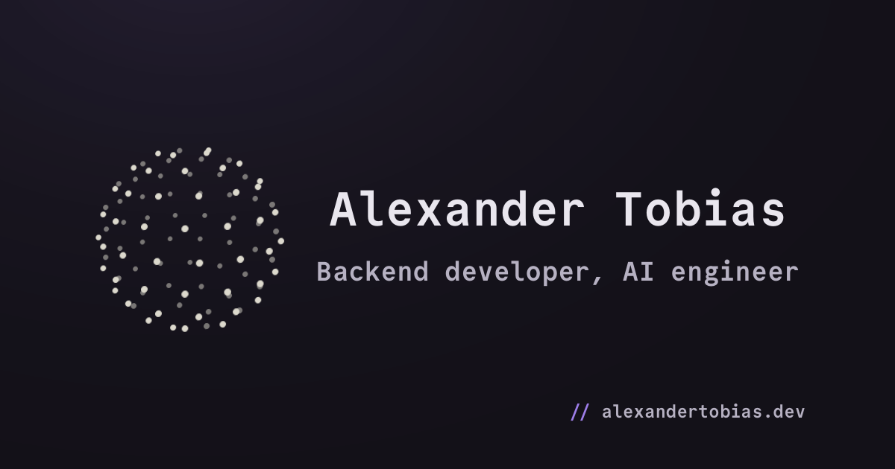

# Bliss

My portfolio website, live at [alexandertobias.dev](https://alexandertobias.dev).
Built with [Astro](https://astro.build) and Tailwind, deployed as static assets on Cloudflare.

## Commands

| Command           | Action                                       |
| :---------------- | :------------------------------------------- |
| `npm install`     | Install dependencies                         |
| `npm run dev`     | Start local dev server at `localhost:4321`   |
| `npm run build`   | Build production site to `./dist/`           |
| `npm run preview` | Preview the production build locally         |
| `npm test`        | Run unit tests                               |

## License

Source code is [MIT](LICENSE). Written content and media are [CC BY-NC-ND 4.0](LICENSE-CONTENT).
The Commit Mono font stays under its own [SIL OFL](src/assets/fonts/commit-mono/OFL.txt), and
third-party brand icons remain trademarks of their owners.
